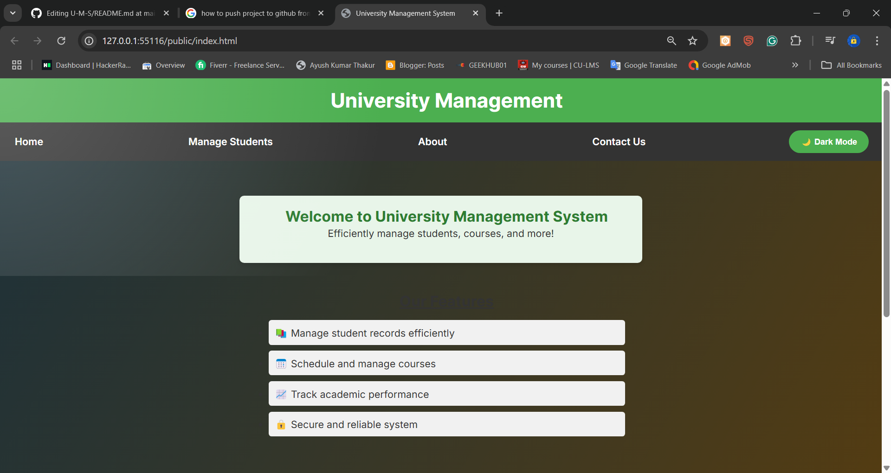
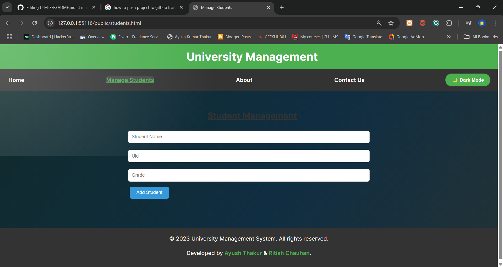
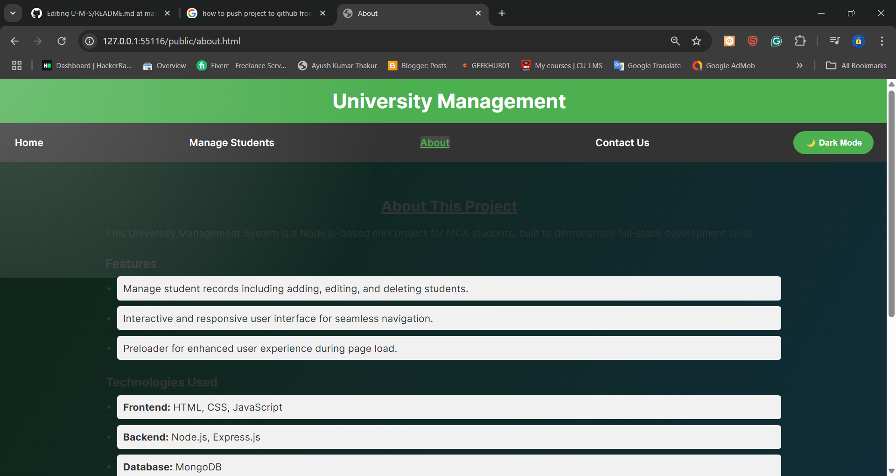
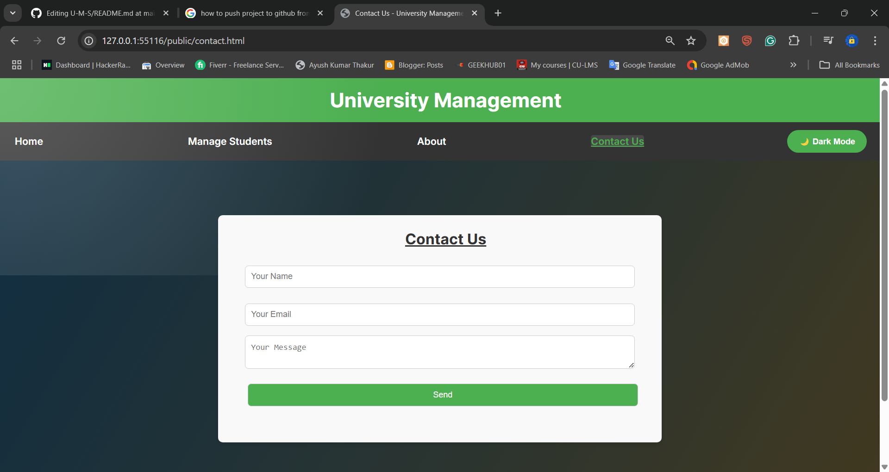

#U-M-S 🎓

# 🎓 University Management System

A full-stack web application designed to efficiently manage university operations, including student records, courses, and more. This project demonstrates the integration of frontend and backend technologies to create a functional and user-friendly system.

---

## 📑 Table of Contents

1. [✨ Features](#features)
2. [🛠️ Technologies Used](#technologies-used)
3. [⚙️ Installation](#installation)
4. [🚀 Usage](#usage)
5. [📂 Project Structure](#project-structure)
6. [📸 Screenshots](#screenshots)
7. [🔮 Future Enhancements](#future-enhancements)
8. [👩‍💻 About the Developers](#about-the-developers)
9. [📜 License](#license)

---

## ✨ Features

- **👨‍🎓 Student Management**: Add, edit, and delete student records with ease.
- **📱 Responsive Design**: Optimized for various devices, ensuring a seamless experience on desktops, tablets, and mobile devices.
- **🌙 Dark Mode**: Toggle between light and dark themes with persistent state saved in `localStorage`.
- **⏳ Preloader**: Enhanced user experience with a loading animation during page load.
- **🖱️ Smooth Scrolling**: Seamless navigation across the application for better usability.
- **📧 Contact Form**: A simple form to collect user inquiries and feedback.
- **🎨 Interactive UI**: Clean and modern design with hover effects and animations.
- **🍃 Database Integration**: Replace in-memory storage with MongoDB for persistent data storage.

---

## 🛠️ Technologies Used

### Frontend:
- **📄 HTML**: Structure of the web pages.
- **🎨 CSS**: Styling and layout, including responsive design and dark mode.
- **⚡ JavaScript**: Client-side interactivity and API integration.

### Backend:
- **🟢 Node.js**: Server-side runtime environment.
- **🚀 Express.js**: Framework for building RESTful APIs.
- **✅ Joi**: Data validation for API requests.

### Database:
- **🍃 MongoDB**: (Planned for future integration) A NoSQL database for persistent data storage.

---

## ⚙️ Installation

Follow these steps to set up the project locally:

1. Clone the repository:
   ```bash
   git clone https://github.com/your-username/university-management-system.git
   ```
2. Navigate to the project directory:
   ```bash
   cd university-management-system
   ```
3. Install the required dependencies:
   ```bash
   npm install
   ```
4. Start the server:
   ```bash
   npm start
   ```
5. Open your browser and visit:
   ```
   http://localhost:3000
   ```

---

## 🚀 Usage

- Navigate to the **Manage Students** page to add, edit, or delete student records.
- Use the **🌙 Dark Mode** toggle button to switch between light and dark themes.
- Explore the **ℹ️ About** page to learn more about the project and its developers.
- Use the **📧 Contact Us** page to send inquiries or feedback.

---

## 📂 Project Structure

```
/public
  ├── css
  │   └── style.css       # Stylesheet for the application
  ├── js
  │   └── script.js       # Client-side JavaScript
  ├── index.html          # Home page
  ├── students.html       # Manage Students page
  ├── about.html          # About page
  ├── contact.html        # Contact Us page
/server.js                # Backend server
/package.json             # Project metadata and dependencies
```

---

## 📸 Screenshots

> **Note**: Store all screenshots in the `/public/screenshots` directory.

### 🏠 Home Page


### 📋 Manage Students Page


### 🌙 About


### 📧 Contact Us Page


---

## 🔮 Future Enhancements

- **🔒 Role-Based Access Control**: Add user authentication and authorization for secure access.
- **📚 Course Management**: Extend functionality to manage courses, schedules, and faculty.
- **🌐 Deployment**: Host the application on platforms like Heroku, Vercel, or AWS for live access.
- **🧪 Testing**: Add unit and integration tests for the backend API using tools like Jest or Mocha.
- **⚠️ Error Handling**: Implement centralized error handling for better debugging and user feedback.

---

## 👩‍💻 About the Developers

This project was developed by **Ayush Thakur** and **Ritish Chauhan**, MCA students at Chandigarh University. They are passionate about software development and created this project to enhance their skills in full-stack development.

- [Ayush Thakur](https://github.com/aayushthakur001/)
- [Ritish Chauhan](https://github.com/ritish-chauhan)

---

## 📜 License

This project is licensed under the [ISC License](LICENSE).
